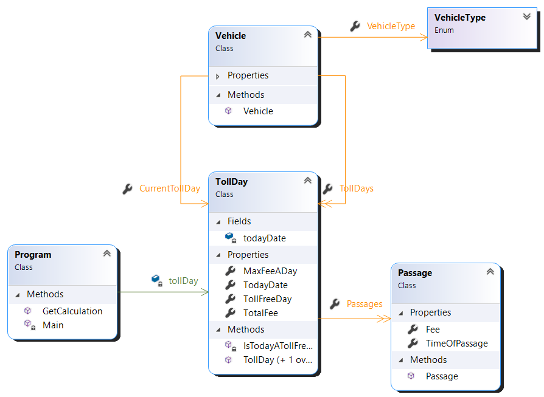

<body style =" font-family:Audiowide; font-size:120%">

# Toll Calculator

---

 

Contains project for unit testing (TollCalculatorTest.csproj) and the actual application (TollCalculator.csproj).

## Application

---

This is a simple Console application to calculate the toll fee for passes in Gothenburg according to current rules. In this application there are no considerations taken for the exeption for passings from Backa (more info can be found at the swedish [transport agency](https://transportstyrelsen.se/sv/vagtrafik/Trangselskatt/Trangselskatt-i-goteborg/undantag-fran-trangselskatt-i-backa/)).

 

**Technologies:**

- .NET Framework 5.0

- C# 9.0 (default)

 

**The objects are:**

- VehicleTypes (enum)
- Calendar (static)
- Passage
- TollDay
- Vehicle
- TollFeeCalculator (static)

And their associations can be seen in the class diagram <a id="back"> [here](#img)</a>

 

## **Nugets**

---

 

### Nager.Date

Used to get weekends and Swedish holidays. Package available via [nuget](https://www.nuget.org/packages/Nager.Date) and [github](https://github.com/nager/Nager.Date).

or install using package manager:

`PM> install-package Nager.Date`

 

## xUnit

For the unit testing.

xUnit ver. 2.4.1.

Package avaliable via [nuget](https://www.nuget.org/packages/xunit/2.4.1) and [github](https://github.com/xunit/xunit) or install using package manager:

` PM> Install-Package xunit -Version 2.4.1`

 

xUnit.runner.visualstudio ver. 2.4.3.

Available via [nuget](https://www.nuget.org/packages/xunit.runner.visualstudio/2.4.3) and [Github](https://github.com/xunit/visualstudio.xunit) or install using package manager:

`PM> Install-Package xunit.runner.visualstudio -Version 2.4.3`

 

### coverlet.collector

Available via [nuget](https://www.nuget.org/packages/coverlet.collector/3.1.0) and [github](https://github.com/coverlet-coverage/coverlet) or install using package manager:

`PM> Install-Package coverlet.collector -Version 3.1.0 `

 

#### Microsoft.NET.Test.Sdk

Ver. 17.0.0. Package available via [nuget](https://www.nuget.org/packages/Microsoft.NET.Test.Sdk/17.0.0) and [github](https://github.com/microsoft/vstest/) or install using package:

`PM> Install-Package Microsoft.NET.Test.Sdk -Version 17.0.0`

## Unit testing

**The objects are:**

- CalendarTest (6)
- ProgramTest (8)
- TollDayTest (2)
- TollFeeCalculatorTest (2)

 

<a alt="class diagram" id = "img" alt= "image class diagram" style = "margin-left: auto; margin-right: auto;text-decoration:none;color:pink">class diagram</a>

<a style = "color: red;font-weight:1000; font-size:150%;" href = "#back">Up</a>

</body>
